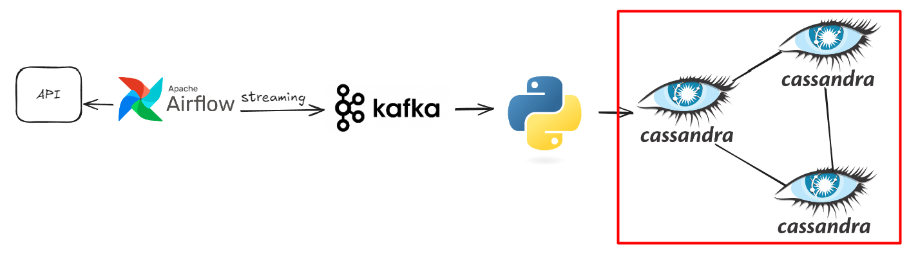
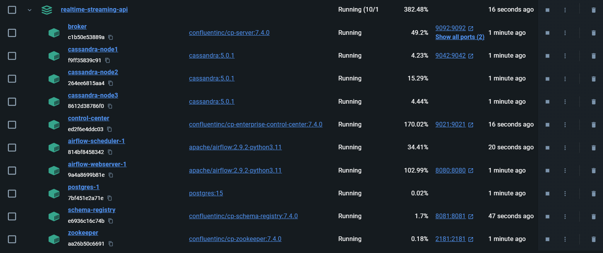
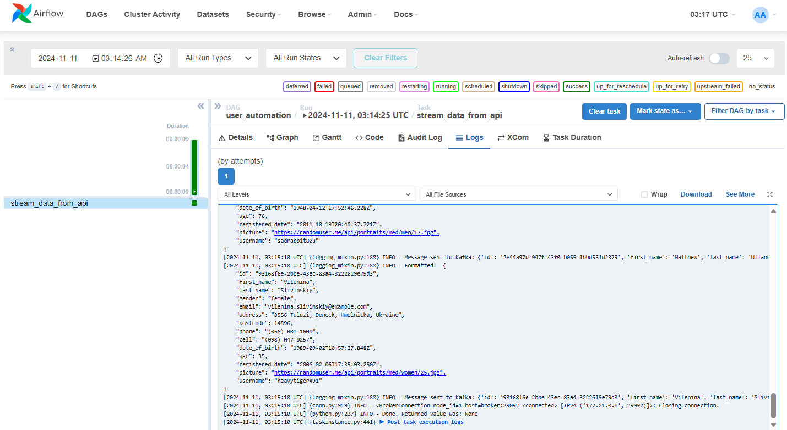
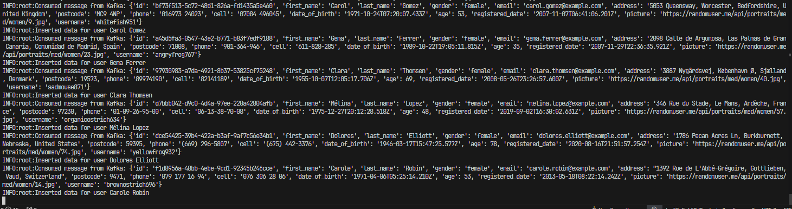
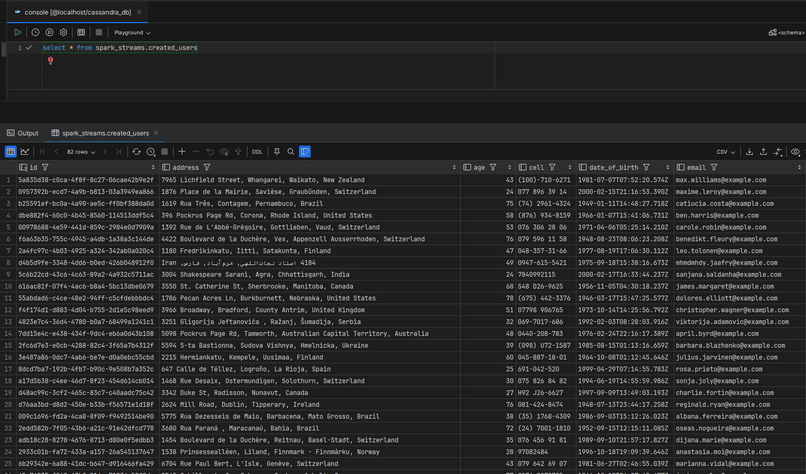
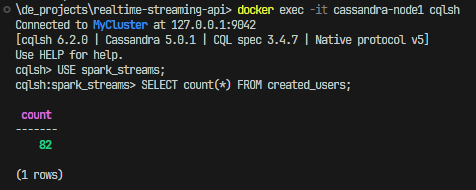
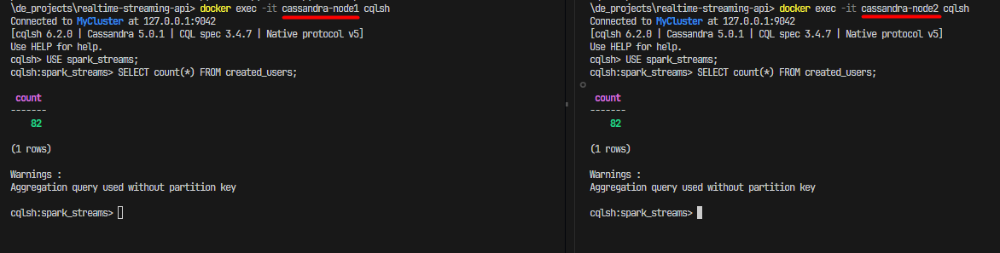

# Realtime Data Streaming

## References

* [Realtime Data Streaming](https://www.youtube.com/watch?v=GqAcTrqKcrY&t=3s&ab_channel=CodeWithYu)
* [Apache Cassandra Documentation](https://cassandra.apache.org/doc/latest/)
* [TaskFlow API — Airflow Documentation](https://airflow.apache.org/docs/apache-airflow/2.3.1/tutorial_taskflow_api.html)

## Architecture



Data Source: [Random User Generator | Home](https://randomuser.me/)

* Apache Airflow
* Apache Zookeeper
* Apache Kafka
  * Broker
  * Schema registry
  * Control center
* Apache Spark
  * Master
  * Worker
* Cassandra

| App UI               | URL                                                           |
| -------------------- | ------------------------------------------------------------- |
| Airflow              | [http://localhost:8080/home](http://localhost:8080/home)         |
| Kafka Control Center | [http://localhost:9021/clusters](http://localhost:9021/clusters) |
| Spark Master         | [http://localhost:9090/](http://localhost:9090/)                 |

## Run the project locally

#### Prerequisite

* Docker & Docker compose
* Python >= 3.10
* Random User API key

Install Python packages:

```
python -m pip install -r requirements.txt
```

#### Run docker-compose

From the root of that project folder:

```
docker-compose up -d

```



### Call API & produce data

Trigger the DAG on Airflow UI



### Consume Kafka using Python script

```
python ./user_kafka_consumer.py
```



## Connect to Cassandra cluster

Via localhost:9042 (Cassandra mounted port)



Access node 1:

```
 docker exec -it cassandra-node1 cqlsh
```

Query:

```
USE spark_streams;
SELECT count(*) FROM created_users;
```

Result:



Then access node 2:

```
docker exec -it cassandra-node2 cqlsh

```

Result will be the same


